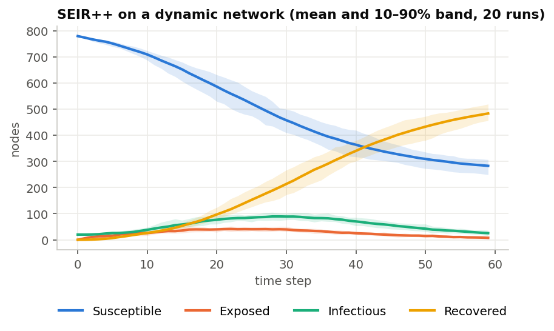
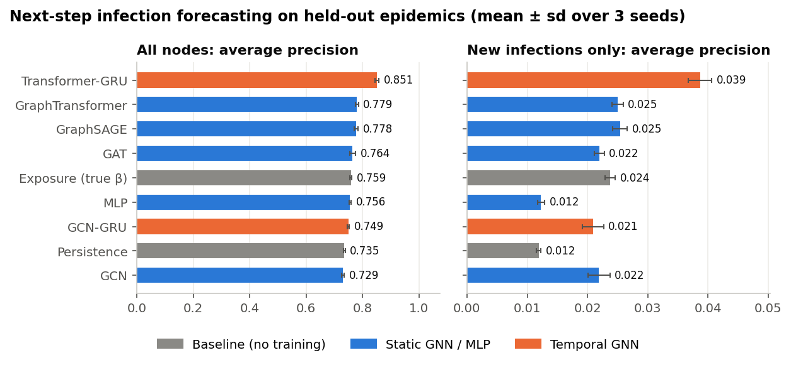
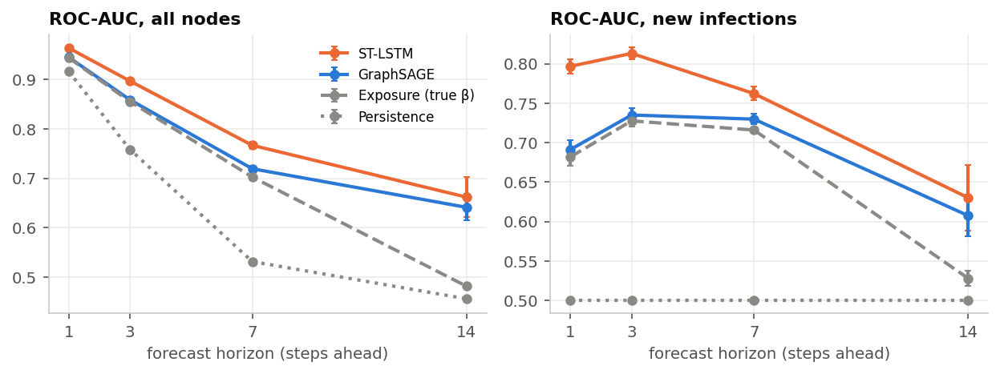
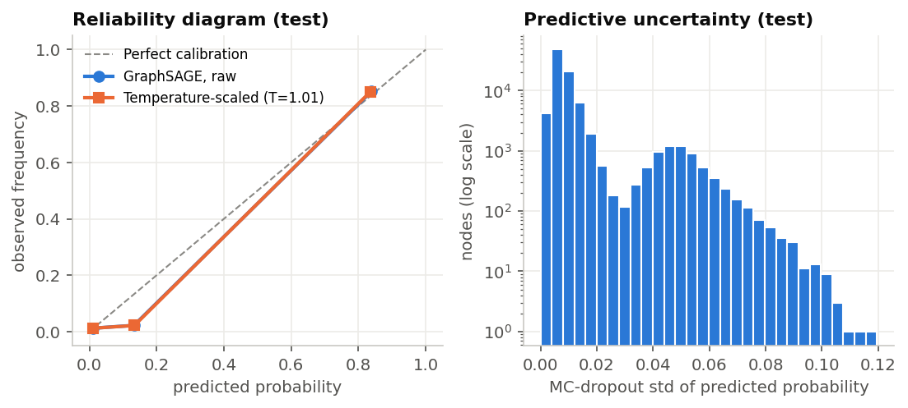
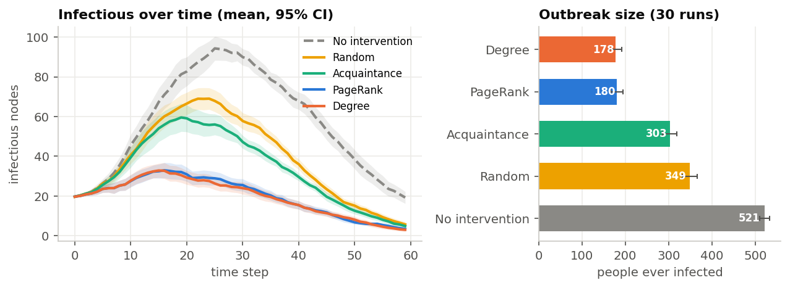

# EpiGraph-X

**Who will be infected next? Node-level epidemic forecasting on dynamic contact networks with graph neural networks.**

[](https://github.com/sainikethkosaraju/EpiGraphX/actions/workflows/tests.yml)


Classical SEIR models predict *how many* people get sick. EpiGraph-X asks *which* people: it
simulates outbreaks on contact networks that change every day, then trains graph neural networks
(GNNs) to forecast each person's infection status one to fourteen steps ahead. It also measures how
well-calibrated those forecasts are and compares vaccination strategies.

<p align="center"></p>

## Headline findings

* **A temporal graph transformer is the best forecaster.** On new infections it reaches ROC-AUC **0.82**, against 0.71 for the best static GNN, 0.69 for a mechanistic baseline and 0.52 for a model that ignores the graph.
* **Most of the signal is "who is sick, and who touches them".** Hand-crafted centrality features add nothing once the model can pass messages over the graph.
* **Forecast skill decays with horizon.** At 14 steps ahead everything approaches chance, and the temporal model's edge shrinks.
* **The best models are well calibrated** (ECE < 0.01), and Monte-Carlo dropout uncertainty is nearly 3× higher on the predictions that turn out wrong.
* **Vaccinating hubs cuts outbreaks by about 66%** vs about 33% for random vaccination. A PPO agent learns to match, but not beat, the degree rule.

## What's inside

| Component | Description | Code |
|---|---|---|
| Dynamic contact networks | Barabási–Albert, Watts–Strogatz or Erdős–Rényi base graph. 5% of edges are rewired per step (contact count stays constant), plus random one-step super-spreader gatherings. | [`graphs.py`](epigraphx/graphs.py) |
| SEIR++ simulator | Stochastic S→E→I→R→S on the network. Poisson incubation and infectious periods, symptomatic and asymptomatic cases, waning immunity. Vectorised: transmission is `1-(1-β)^k` for *k* infectious contacts. | [`simulation.py`](epigraphx/simulation.py) |
| Learning task | Per node at time *t*: degree, clustering, PageRank, *currently infectious*. Exposed people are **not observable**, as in a real outbreak. Target: infectious at *t+h*. | [`data.py`](epigraphx/data.py) |
| Models | MLP (no graph), GCN, GraphSAGE, GAT, Graph Transformer; temporal GCN-GRU and Transformer-GRU; multi-horizon ST-LSTM | [`models.py`](epigraphx/models.py) |
| Baselines | *Persistence* (infected now → infected later) and *Exposure* (`1-(1-β)^k` using the true β), scored on exactly the same nodes | [`baselines.py`](epigraphx/baselines.py) |
| Uncertainty | Expected calibration error, temperature scaling, Monte-Carlo dropout | [`metrics.py`](epigraphx/metrics.py), [`train.py`](epigraphx/train.py) |
| Interventions | Vaccinate 5 susceptible people per step by degree, PageRank, acquaintance sampling or at random. Also a PPO agent that learns which rule to use when. | [`interventions.py`](epigraphx/interventions.py), [`train_ppo.py`](scripts/train_ppo.py) |

### Evaluation protocol

* **Train, validation and test sets are separate simulated epidemics** (6 / 2 / 2 per seed), each on its own network. No time step of a test outbreak is ever seen during training.
* Early stopping and temperature fitting use the validation epidemics only.
* All numbers are **mean ± standard deviation over 3 independent seeds**.
* Two scores are reported for every model. **All nodes** includes people who are already infectious, most of whom will still be infectious tomorrow; this part is easy. **New infections** covers only people not yet infectious, which is the actual forecasting problem.

## Results

### 1. Next-step forecasting (t + 1)

<p align="center"></p>

| Model | Type | ROC-AUC | AP | ROC-AUC (new) | AP (new) | ECE | ECE after temp. scaling |
|---|---|---|---|---|---|---|---|
| Persistence | baseline | 0.919 ± 0.001 | 0.735 ± 0.003 | 0.500 ± 0.000 | 0.012 ± 0.000 | 0.022 ± 0.001 | – |
| Exposure (true β) | baseline | 0.948 ± 0.000 | 0.759 ± 0.003 | 0.693 ± 0.001 | 0.024 ± 0.001 | 0.019 ± 0.001 | – |
| MLP | static | 0.923 ± 0.002 | 0.756 ± 0.004 | 0.521 ± 0.020 | 0.012 ± 0.001 | 0.001 ± 0.001 | 0.001 ± 0.001 |
| GCN | static | 0.941 ± 0.002 | 0.729 ± 0.005 | 0.667 ± 0.017 | 0.022 ± 0.002 | 0.014 ± 0.002 | 0.010 ± 0.002 |
| GraphSAGE | static | 0.950 ± 0.001 | 0.778 ± 0.007 | 0.708 ± 0.004 | 0.025 ± 0.001 | 0.003 ± 0.001 | 0.001 ± 0.001 |
| GAT | static | 0.946 ± 0.002 | 0.764 ± 0.010 | 0.682 ± 0.011 | 0.022 ± 0.001 | 0.005 ± 0.001 | 0.004 ± 0.001 |
| GraphTransformer | static | 0.950 ± 0.001 | 0.779 ± 0.006 | 0.706 ± 0.006 | 0.025 ± 0.001 | 0.004 ± 0.000 | 0.003 ± 0.001 |
| GCN-GRU | temporal | 0.941 ± 0.003 | 0.749 ± 0.004 | 0.658 ± 0.019 | 0.021 ± 0.002 | 0.015 ± 0.004 | 0.009 ± 0.003 |
| **Transformer-GRU** | temporal | **0.968 ± 0.001** | **0.851 ± 0.006** | **0.815 ± 0.006** | **0.039 ± 0.002** | 0.004 ± 0.002 | 0.002 ± 0.001 |

About 7.4% of test nodes are infectious at *t+1*. Only about 1% of not-yet-infectious nodes become infectious in the next step, which is why AP on new infections is small in absolute terms. Persistence scores exactly chance (0.5 AUC) there by construction.

* **Temporal attention wins clearly.** Transformer-GRU improves new-infection ROC-AUC from 0.71 (best static model) to **0.82**, and new-infection AP by about 55%. Its recent history reveals who was near infectious people over the last few steps, who are probably in the hidden *exposed* stage.
* **The graph matters.** The MLP, which has the same features but no message passing, is no better than chance on new infections (0.52 AUC). Every static GNN reaches 0.67–0.71.
* **A strong baseline keeps the static GNNs honest.** The mechanistic *Exposure* score, which uses the true transmission rate, reaches 0.69 AUC on new infections. Static GNNs match or slightly beat it without being told β.
* **GCN-based models lag.** GCN's symmetric normalisation averages a node's own status with its neighbours', blurring the most informative feature. GCN-GRU inherits this weakness. GraphSAGE and attention layers keep a separate self-connection.

### 2. Forecasting further ahead

A multi-output ST-LSTM (GraphSAGE encoder + LSTM over the last 5 snapshots) against a static
GraphSAGE trained on the same four horizons:

<p align="center"></p>

ROC-AUC on **new infections**:

| Model | t+1 | t+3 | t+7 | t+14 |
|---|---|---|---|---|
| Persistence | 0.500 ± 0.000 | 0.500 ± 0.000 | 0.500 ± 0.000 | 0.500 ± 0.000 |
| Exposure (true β) | 0.682 ± 0.011 | 0.728 ± 0.008 | 0.716 ± 0.003 | 0.528 ± 0.009 |
| GraphSAGE | 0.691 ± 0.011 | 0.735 ± 0.009 | 0.730 ± 0.006 | 0.607 ± 0.026 |
| ST-LSTM | **0.797 ± 0.009** | **0.813 ± 0.008** | **0.762 ± 0.009** | **0.630 ± 0.042** |


ROC-AUC on **all nodes**:

| Model | t+1 | t+3 | t+7 | t+14 |
|---|---|---|---|---|
| Persistence | 0.917 ± 0.001 | 0.759 ± 0.001 | 0.531 ± 0.001 | 0.456 ± 0.004 |
| Exposure (true β) | 0.944 ± 0.002 | 0.856 ± 0.004 | 0.703 ± 0.004 | 0.482 ± 0.005 |
| GraphSAGE | 0.945 ± 0.002 | 0.859 ± 0.004 | 0.719 ± 0.006 | 0.641 ± 0.027 |
| ST-LSTM | **0.964 ± 0.001** | **0.897 ± 0.004** | **0.767 ± 0.008** | **0.662 ± 0.041** |


The advantage of seeing the recent past is largest at short horizons, where it reveals who was
recently near infectious people (and is therefore probably in the hidden *exposed* stage). By 14 steps
ahead the outbreak has moved on, and every method converges toward chance.

### 3. Calibration and uncertainty

<p align="center"></p>

The 0.40 ECE in the original report came from a bug (the sigmoid was applied twice). With that fixed, the trained models are already well calibrated: GraphSAGE has ECE ≈ 0.003, and the fitted temperature is T = 1.01, so scaling barely changes anything. Predictions are strongly bimodal (near 0 for most people, about 0.85 for those currently infectious), which is why the reliability diagram has few populated bins.

Monte-Carlo dropout (30 passes) gives a useful warning signal. The predictive standard deviation is **2.9× larger on misclassified nodes** (0.030 vs 0.011 on correct ones). The second mode of the histogram is the uncertain group.

### 4. What the model uses (feature ablation, GraphSAGE)

| Feature removed | AP | ROC-AUC (new) |
|---|---|---|
| none (all features) | 0.778 ± 0.007 | 0.708 ± 0.004 |
| degree | 0.776 ± 0.008 | 0.706 ± 0.006 |
| clustering | 0.778 ± 0.007 | 0.709 ± 0.006 |
| pagerank | 0.778 ± 0.004 | 0.707 ± 0.004 |
| infected_now | 0.110 ± 0.014 | 0.609 ± 0.033 |


Removing degree, clustering or PageRank changes nothing: two rounds of message passing let the GNN
read the local structure directly from the graph. Removing *currently infectious* destroys the model.
Who is sick right now and who they are connected to is what matters.

### 5. Different network structures

| Base network | Model | AP | ROC-AUC (new) |
|---|---|---|---|
| Barabási–Albert (hubs) | Exposure (true β) | 0.759 ± 0.003 | 0.693 ± 0.001 |
| Barabási–Albert (hubs) | GraphSAGE | 0.778 ± 0.007 | 0.708 ± 0.004 |
| Watts–Strogatz (small world) | Exposure (true β) | 0.758 ± 0.006 | 0.702 ± 0.015 |
| Watts–Strogatz (small world) | GraphSAGE | 0.777 ± 0.004 | 0.714 ± 0.018 |
| Erdős–Rényi (random) | Exposure (true β) | 0.755 ± 0.008 | 0.694 ± 0.011 |
| Erdős–Rényi (random) | GraphSAGE | 0.774 ± 0.011 | 0.702 ± 0.015 |

GraphSAGE beats the mechanistic baseline by a similar margin on every topology. The learned model is not tied to one network family.

### 6. Vaccination strategies

Vaccinating 5 susceptible people per step (of 800), 30 paired runs (every strategy faces the same
network and random draws):

<p align="center"></p>

| Strategy | Needs | People ever infected | Peak infectious | Reduction |
|---|---|---|---|---|
| Degree | full contact graph | 178 ± 41 | 37.2 ± 9.7 | 66% |
| PageRank | full contact graph | 180 ± 40 | 37.4 ± 10.1 | 65% |
| Acquaintance | only local contacts | 303 ± 47 | 65.5 ± 17.5 | 42% |
| Random | nothing | 349 ± 48 | 75.1 ± 15.4 | 33% |
| No intervention | – | 521 ± 32 | 104.1 ± 15.5 | 0% |

Targeting hubs cuts the outbreak by about two thirds. Acquaintance sampling ("vaccinate a random friend of a random person") needs no global map of the network, yet still does clearly better than random vaccination, because friends of random people tend to have many contacts.

**Reinforcement learning.** A PPO agent chooses each step *which* rule to use (degree / PageRank / acquaintance / random). It was trained for 30,000 steps on 400-node networks and evaluated on 20 unseen epidemics:

| Strategy | People ever infected |
|---|---|
| PageRank | 46.8 ± 16.7 |
| Degree | 47.5 ± 15.2 |
| PPO meta-policy | 51.5 ± 15.8 |
| Acquaintance | 93.2 ± 21.2 |
| Random | 121.7 ± 25.8 |
| No intervention | 258.6 ± 23.9 |

PPO ends up within noise of the hub-targeting rules, far ahead of random and acquaintance, but does not beat them. With a fixed per-step budget, the simple greedy rule is already very hard to improve on.

## Quick start

```bash
git clone https://github.com/sainikethkosaraju/EpiGraphX.git
cd EpiGraphX
pip install torch --index-url https://download.pytorch.org/whl/cpu   # or a CUDA build
pip install -r requirements.txt
pip install -e .

pytest -q                                          # 17 tests, ~20 s
python -m epigraphx.experiments --quick            # smoke run, < 1 min
python -m epigraphx.experiments                    # full study (~2 h on 2 CPU cores)
python -m epigraphx.experiments --only interventions
python -m epigraphx.plots                          # regenerate figures from results/
python scripts/train_ppo.py --timesteps 30000      # RL meta-policy
python scripts/summarize.py                        # print the tables above
```

All settings live in [`epigraphx/config.py`](epigraphx/config.py), and each run writes its exact configuration to `results/config.json`.

```
epigraphx/
├── config.py          experiment settings
├── graphs.py          dynamic contact networks
├── simulation.py      SEIR++ (one step function shared by everything)
├── data.py            features, labels, epidemic-level splits
├── models.py          MLP, GCN, GraphSAGE, GAT, Graph Transformer, temporal GNNs
├── baselines.py       persistence and exposure references
├── train.py           training, early stopping, MC dropout
├── metrics.py         AUC/AP, ECE, temperature scaling
├── interventions.py   vaccination policies + Gymnasium environment
├── experiments.py     every experiment behind this README
└── plots.py           figures
scripts/               PPO training, table summary
tests/                 unit tests (simulator invariants, model shapes, metrics, RL env contract)
results/               CSV/JSON outputs and figures from the full run
```

## Changes from the course version

This repository is a rebuild of our CSD456 (Deep Learning) course project at Shiv Nadar University.
Re-reading the original notebook turned up problems that made its reported numbers unreliable, so
they were fixed and every experiment was re-run.

| Issue in the original | Fix |
|---|---|
| Seed cases started with an infectious timer of 0, so all 20 recovered at step 1 and the outbreak only started by chance | Seed cases get a proper infectious period |
| "Rewiring" mostly *added* edges, so the network densified about 10× over the run | True rewiring: remove one edge, add one, so contact count stays constant |
| Temporal models were scored on sequences that included their training data | Held-out epidemics for all testing |
| Temporal windows stopped one step before the prediction time | Window ends at *t* |
| "TGAT-like" model was a static per-snapshot transformer; "diffusion transformer" had no diffusion | Honest names (Graph Transformer); real temporal variants (Transformer-GRU) |
| Vaccination policies re-picked the same top-5 hubs every step, mostly people already immune | Policies choose among susceptible people only |
| Calibration plot applied the sigmoid twice | Single sigmoid; added ECE and temperature scaling |
| Single run, no baselines, empty ablation output | 3 seeds, two baselines, working ablation and topology sweeps |
| One 1,350-line notebook with copy-pasted dynamics in three places | Package with one shared `step` function and unit tests |

## Limitations

* Everything is simulated. The networks and disease parameters are plausible but not fitted to real data.
* Graphs have 800 nodes. The code is not optimised for city-scale networks.
* Exposure history is only available to the temporal models through their input window. Adding explicit exposure-count features to the static models would be a fair next comparison.

## Authors

**Sai Niketh Kosaraju** and **Sanjay Muthyala**. Course project for CSD456 Deep Learning (instructor:
Dr. Saurabh Janardan Shigwan), Shiv Nadar University, 2025.

## References

Kipf & Welling (2017) GCN · Hamilton et al. (2017) GraphSAGE · Veličković et al. (2018) GAT ·
Shi et al. (2021) Masked label prediction / TransformerConv · Gal & Ghahramani (2016) MC dropout ·
Guo et al. (2017) On calibration of modern neural networks · Cohen, Havlin & ben-Avraham (2003)
Acquaintance immunization · Pastor-Satorras et al. (2015) Epidemic processes in complex networks ·
Schulman et al. (2017) PPO.
